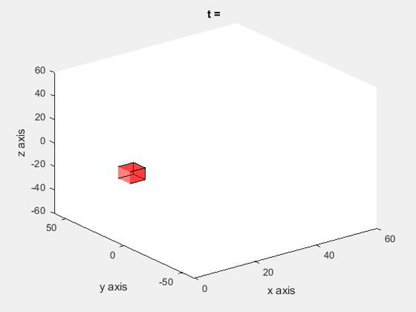
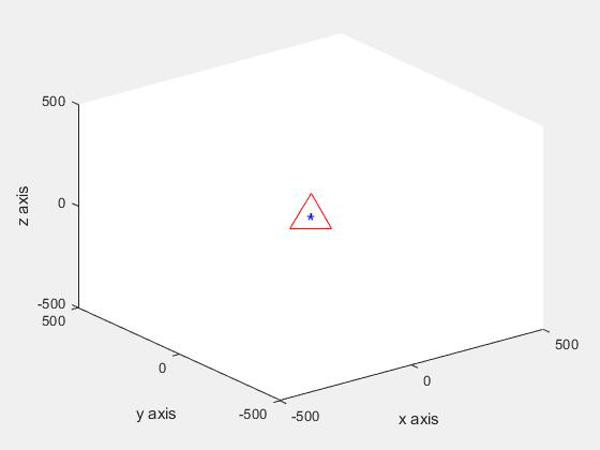

# This repo contains code for Performance Optimization Of The 6DOF de-Centralized Docking Controller Using Genetic Algorithms
### Disturbances on a satellite in a low earth orbit
### 6DOF motion of one satellite in another's Frame of reference
### Design for a Optimal controller for the translational motion
### Design for a Sliding mode controller for the attitute motion
### Using Genetic Algorithms to optimize the performance

